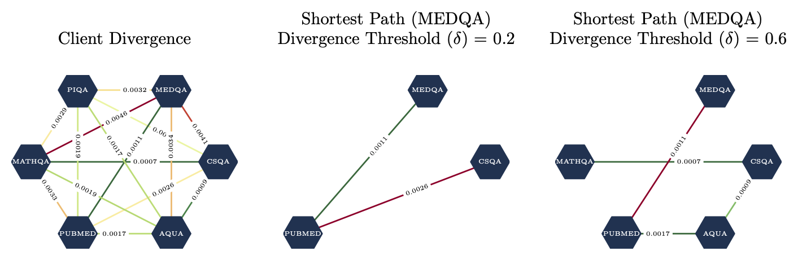

# Domain Preservation of Large Language Models with Divergence Reduction In Federated Training (DRIFT)  
-------------------------------------------------
**Main code repository for DRIFT.**   

```
data/: contains utility functions for data processing as well as thought training data.  
src/: contains all FL methods alongwith training with CPO and DPO.  
utils/: contains utility function used within the code base.
```

<p align="center">
  
  
</p>

--------------------------------------------------

All experiments are conducted using the following scientific libraries and frameworks:  
- Scipy
- NumPy
- Huggingface Transformers
- Flower (flwr)
